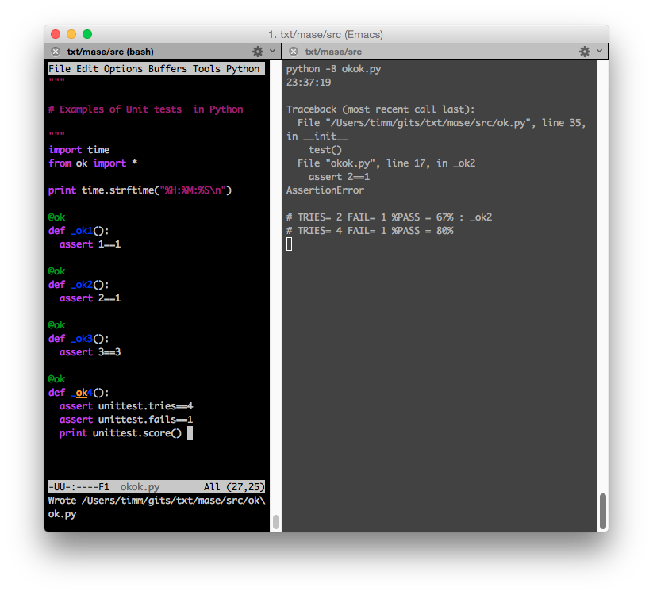

[](https://github.com/txt/mase/blob/master/README.md)   
[At a glance...](https://github.com/txt/mase/blob/master/OVERVIEW.md) |
[Syllabus](https://github.com/txt/mase/blob/master/SYLLABUS.md) |
[Models](https://github.com/txt/mase/blob/master/MODELS.md) |
[Code](https://github.com/txt/mase/tree/master/src) |
[Lecturer](http://menzies.us) 


# Coding Homework 1

## What to Hand in

After doing all the following, you should 
be able to write one file hw/code/1/README.md in your repo showing:

+ A screen snap of the top level of your repo
+ Output of the commands `python --version`, `pip help`, `easy_install -h`      
+ A screen shot of what it looks like to write code in your preferred Python IDE (hint: need to see syntax highlighting).
+ A screenshot of output of your `okok.py` test (defined below).

## Instructions

### Get your Git on

+ Create a public Github repository for all your work for this subject.
      + The name of that repo should be `x9115xxx` where `xxx` is anything you like.
+ Invite `timm` and ``rahink`` to that repo.
+ Add directories to that repo
      + project
      + paper
      + hw/read
      + hw/code/1
      + hw/code/2
      + hw/code/3
      + ...
      + hw/code/9

### Get your Python On

Make sure you can can get to Python 2.7

For this subject, the lecturer and support will support your Python code on the intenet IDE [Cloud9](http://c9.io).
You can use any other platform you like, of course, but any systems issues (e.g. installing of important packages)
are your responsibility.

While you do not need to use Cloud9, you do need
to show that you have a _power platform_ for Python development:

+ Check you have `pip` installed
+ Check you have `easy_install` install
+ Check your code editor does syntax highligting of your Python code.

### Get your Test-Driven Development On.

1. Watch the great [Kent Beck video on how to write a test engine in just a few lines of code](https://www.youtube.com/watch?v=nIonZ6-4nuU). Note
that that example is in CoffeeScript. For the equivalent Python code, see
[ok.py](src/ok.md).
2. Get the Python equivalent of the watch command used by Beck. Specifically, run the command
   `sudo pip install rerun`
3. Download the files
     + [ok.py](src/ok.md).
     + [okok.py](src/okok.md)
4. Get two windows open:
	 + One editting okok.py
	 + One in a shell
5. In the shell, type `rerun "python -B okok.py`
6. Add one more unittest to `okok.py`.
     + Important... leave behind at least one failing test.
7. Your screen should now look something like this:




## Hints


### Images in Markdown

To include images in your markdown...

```

```

If the image is too wide, you can also use

```

```

### Help with Git and Github

If you need tutorial help with Gitbub, see the tutor. But, for a cheats guide, here is the Makefile
that the lecturer drops into all his repos:

```
# File:  setup/Makefile (from github.com/txt/evil)
# Usage: make
typo:   ready
    @- git status
    @- git commit -am "saving"
    @- git push origin master # insert your branch names here

commit: ready
    @- git status
    @- git commit -a
    @- git push origin master

update: ready
    @- git pull origin master

status: ready
    @- git status

ready:
    @git config --global credential.helper cache
    @git config credential.helper 'cache --timeout=3600'

timm:  # <== change to your name
    @git config --global user.name "Tim Menzies" #<== your name
    @git config --global user.email tim.menzies@gmail.com #<== your email
```

### Working with Cloud9

As of June 2015, the procedure for doing that was:

+ Go to Github and create an empty repository.
+ Log in to Cloud9 using your GitHub username (at `http://c9.io`, there is a button for that, top right).
+ Hit the green _CREATE NEW WORKSPACE_ button
    + Select _Clone from URL_;
    + Find _Source URL_ and enter in `http://github.com/you/yourRepo`
	+ Wait ten seconds for the screen to change.
	+ Hit the green _START EDITING_ button. 

This will drop you into the wonderful Cloud9
integrated development environment. Here, you can
edit code and (using the above `Makefile`) run `make
typo` to backed up your code outside Cloud9, over at
`Github.com` (which means that if ever Cloud9 goes
away, you will still have your code).

The good news about Cloud9 is that it is very easy
to setup and configure. The bad news is that each
Cloud9 workspace has the same limits as Github- a
1GB size limit. Also, for CPU-intensive
applications, shared on-line resources like Cloud9
can be a little slow. That said, for the newbie,
Cloud9 is a very useful tool to jump start the
learning process.

For sites other than Cloud9, see Koding, Nitrous.IO and many more besides.


_________

Copyright © 2015 [Tim Menzies](http://menzies.us).
This is free and unencumbered software released into the public domain.   
For more details, see the [license](https://github.com/txt/mase/blob/master/LICENSE).

