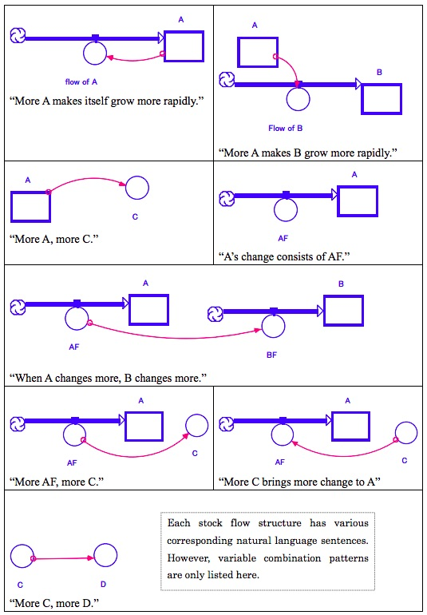
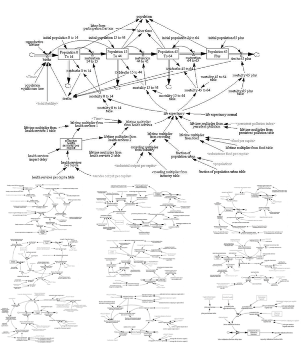
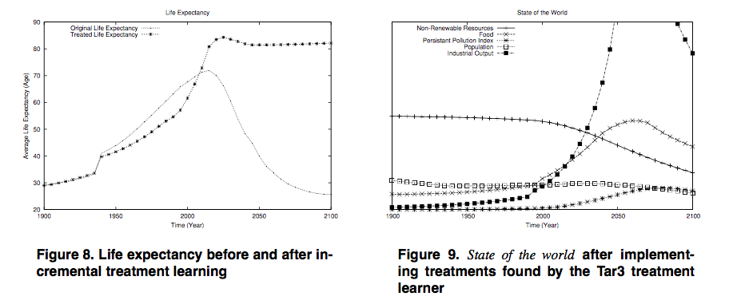

[](https://github.com/txt/mase/blob/master/README.md)   
[At a glance...](https://github.com/txt/mase/blob/master/OVERVIEW.md) |
[Syllabus](https://github.com/txt/mase/blob/master/SYLLABUS.md) |
[Models](https://github.com/txt/mase/blob/master/MODELS.md) |
[Code](https://github.com/txt/mase/tree/master/src) |
[Lecturer](http://menzies.us) 


<em>(I keep being asked... where to get models? where to get models? After this lecture, you will have
access to hundreds of models as well as methods for interviewing humans to learn their models.)</em>

# Domain-Specific Languages 101 (in Python)

This files shows an example of a small object-based DSL (domain-specific language) in Python.
In the language, all the tedious stuff is implemented in superclasses, letting
users express their knowledge in simple succinct subclasses.

The example here will be compartmental modeling and is
 adapted from some  excellent code from
[Abraham Flaxman](https://gist.github.com/aflaxman/4121076#file-sdm_diaper_delivery-ipynb).

Note that students of CSx91 have ready access to many 
[compartmental models about software systems](http://unbox.org/doc/optimalML/madachyBook.pdf) ranging from


to the very complex.


## Theory


Does your language pass the _elbow test_? Do your business users elbow you of the way
in their haste to fix what is obviously wrong with your code?

No?  Then you obviously:

+ You are not speaking their language. 
+ You've lost that an
entire community that might have been able to audit,
verify, and evolve your code.

Enter domain-specific languages (DSLs). DSLs have also been called:

+ [little languages](http://staff.um.edu.mt/afra1/seminar/little-languages.pdf);
+ micro-languages,
+ application languages,
+ very high level languages.

Example DSLs:

+ SQL
+ AWK (unix text reporting language)
+ Regular expressions


DSLs are useful since
different representations of the same concepts can make certain inferences easier. Here's Douglas
Hofstadter from his book _Godel, Esher, Bach:_

+  When you confront a (system) that you know nothing of,... your problem is how to assign interpretations to its symbols in a meaningful way...:

     + You may make several tentative stabs in the dark before finding a good set of words to associate with the symbols.
     + It is very similar to attempts to crack a code, or to decipher inscriptions in an unknown language...
     + When you hit a right choice... all of a sudden things just feel right, and work speeds up enormously.
     + Pretty soon everything falls into place."

Here's James Martin from his book _Design of Real-time Computer Systems_:

+ We must develop languages that the scientist, the architect, the teacher, and the layman can use without being computer experts.
   + The language for each user must be as natural as possible to him.
   + The statistician must talk to his terminal in the language of statistics.
   + The civil engineer must use the language of civil engineering.
   + When a man (sic) learns his profession he must learn the problem-oriented languages to go with that profession.


A DSL is a very high-level language that a user can learn and use in less than a day. Such productivity can only be achieved by tailoring the language to the special needs and skills of a particular class of users in a particular domain.
So one way to find DSL is listen to experts in some field commenting on their processing. Often that processing
has repeated domain-specific idioms:

+ Idioms= Methods imposed by programmers to handle common forms, procedures.
+ E.g. Ensure data is saved before the window is closed.
+ E.g. Before conducting expensive tests, perform cheap tests that can rule out need for expensive tests.

In a DSL-based software development process, the analyst:

+ Identifies the users and their tasks;
+ Identifies the common idioms used by those users;
+ Invents a little language to handle those idioms;
+ Generates sample sentences in that language;
+ Shows those sentences to the user and trains them how to write their own.

That is, instead of the analyst writing the application, the analysts writes tools that let a user community write and maintain their own knowledge.


The benefits of DSL (productivity, explanatory, ownership by the users) can be out-weighed by the cost of building the DSL.  

Two ways to build a DSL:

+ External DSL: code is a string which is read, parsed, and executed by (say) Python.
    + E.g. see [PyParsing](http://www.slideshare.net/Siddhi/creating-domain-specific-languages-in-python)
+ Internal DSL: using features of the language, enable people to write code that resembles domain syntax.
   + See  decorators, context managers
   + Code the idioms in general superclasses;
      + Leave the domain-specific stuff for subclasses

## Writing your own DSL in Python

### Decorators

A test engine, as a Python decorator

```python
def ok(*lst):
  print "### ",lst[0].__name__
  for one in lst: unittest(one)
  return one

class unittest:
  tries = fails = 0  #  tracks the record so far
  @staticmethod
  def score():
    t = unittest.tries
    f = unittest.fails
    return "# TRIES= %s FAIL= %s %%PASS = %s%%"  % (
      t,f,int(round(t*100/(t+f+0.001))))
  def __init__(i,test):
    unittest.tries += 1
    try:
      test()
    except Exception,e:
      unittest.fails += 1
      i.report(test)
  def report(i,test):
    import traceback
    print traceback.format_exc()
    print unittest.score(),':',test.__name__
```

### Context Managers

Here's an idiom for writing HTML:

```Python
from contextlib import contextmanager

@contextmanager
def tag(name):
    print "<%s>" % name
    yield
    print "</%s>" % name

>>> with tag("h1"):
...    print "foo"
...
<h1>
foo
</h1>
```

Another example (print runtime of things):

```python
@contextmanager
def duration():
  t1 = time.time()
  yield
  t2 = time.time()
  print("\n" + "-" * 72)
  print("# Runtime: %.3f secs" % (t2-t1))

def _durationDemo():
  with duration():
    ##do something
```

Yet another example (always close things):

```python
from contextlib import contextmanager
from contextlib import closing
import urllib

@contextmanager
def closing(thing):
    try:
        yield thing
    finally:
        thing.close()

with closing(urllib.urlopen('http://www.python.org')) as page:
    for line in page:
        print line
```

## Other Techniques

Use the sub-classing trick (this works in Python, or any other OO language).

+ Place the generic processing in superclasses.
+ Users write the particulars of their domain in subclasses.
+ Example, see below.

See also [Implementing Domain Specific Languages In Python](http://www.pyvideo.org/video/251/pycon-2010--implementing-domain-specific-language).

## SAF: Stock and Flow (Compartmental Modeling in Python)

From Wikipedia:

+ Economics, business, accounting, and related
  fields often distinguish between quantities that are
_stocks_ and those that are _flows_. These differ in
their units of measurement. 
   + A stock variable is
measured at one specific time, and represents a
quantity existing at that point in time (say,
December 31, 2004), which may have accumulated in
the past. 
   + A flow variable is measured over an
interval of time. Therefore a flow would be measured
per unit of time (say a year). Flow is roughly
analogous to rate or speed in this sense.
+ Examples:
    + A person or country might have stocks of money, financial assets, liabilities, wealth, real means of production, capital, inventories, and human capital (or labor power). 
    + Flow magnitudes include income, spending, saving, debt repayment, fixed investment, inventory investment, and labor utilization.These differ in their units of measurement.
+ Formally:
    + A stock (or "level variable") in this broader sense is some entity that is accumulated over time by inflows and/or depleted by outflows. Stocks can only be changed via flows. Mathematically a stock can be seen as an accumulation or integration of flows over time - with outflows subtracting from the stock. Stocks typically have a certain value at each moment of time - e.g. the number of population at a certain moment.
    +  flow (or "rate") changes a stock over time. 
       Usually we can clearly distinguish inflows (adding to the stock) 
       and outflows (subtracting from the stock). Flows typically 
       are measured over a certain interval of time - e.g., the number 
       of births over a day or month.

For practical purposes, it may be necessary to add _auxillary variables_ to handle some intermediaries (so, in the following,
we can see _nominal productivity_).


Note the `sources` and `sinks` in the above diagram: these are infinite stocks that can generate or receive infinite
volumes.

So, in the following code, look for

```python
S,A,F = Stock, Aux, Flow
```

## Example: Diapers


```
 q   +-----+  r  +-----+
---->|  C  |---->|  D  |--> s
 ^   +-----+     +-+---+
 |                 |
 +-----------------+ 

C = stock of clean diapers
D = stock of dirty diapers
q = inflow of clean diapers
r = flow of clean diapers to dirty diapers
s = out-flow of dirty diapers
```

This is modeled as one `have` methods that initializes:

+ `C,D` as a `Stock` with initial levels 100,0;
+ `q,r,s` as a `Flow` with initial rates of 0,8,0

and as a `step` method that  takes state `u`
and computes a new state `v` at
time `t+dt`.


```python
class Diapers(Model):

  def have(i):
    return o(C = S(100), D = S(0),
             q = F(0),  r = F(8), s = F(0))

  def step(i,dt,t,u,v):
    def saturday(x): return int(x) % 7 == 6
    v.C +=  dt*(u.q - u.r)
    v.D +=  dt*(u.r - u.s)
    v.q  =  70  if saturday(t) else 0 
    v.s  =  u.D if saturday(t) else 0
    if t == 27: # special case (the day i forget)
      v.s = 0
```

Note that the model is just some Python code so we can
introduce any shortcut function (e.g. `saturday`). To write the Python:

+ sum the  in and outflows around each stock;
+ multiply that by the time tick `dt`
+ and add the result back to the stock
+ e.g. `v.C += dt*(u.q - u.r)`

## Implementation

### Some set up code

<a href="dsl101.py#L306-L326"></a><br clear=all>
```python

   1:   import random
   2:   r   = random.random
   3:   isa = isinstance
   4:   
   5:   class o:
   6:     """Emulate Javascript's uber simple objects.
   7:     Note my convention: I use "`i`" not "`this`."""
   8:     def has(i)             : return i.__dict__
   9:     def keys(i)            : return i.has().keys()
  10:     def items(i)           : return i.has().items()
  11:     def __init__(i,**d)    : i.has().update(d)
  12:     def __setitem__(i,k,v) : i.has()[k] = v
  13:     def __getitem__(i,k)   : return i.has()[k]
  14:     def __repr__(i)        : return 'o'+str(i.has())
  15:     def copy(i): 
  16:         j = o()
  17:         for k in i.has(): j[k] = i[k]
  18:         return j
  19:     def asList(i,keys=[]):
  20:       keys = keys or i.keys()
  21:       return [i[k] for k in keys]
```

### Stocks, Flows, Aux are Subclasses of `Has`
  
`Has` is a named thing that knows the `lo` and `hi` values
(and 
if values fall outside that range, this class can `restrain` them in).


<a href="dsl101.py#L337-L356"></a><br clear=all>
```python

  22:   class Has:
  23:     def __init__(i,init,lo=0,hi=100):
  24:       i.init,i.lo,i.hi = init,lo,hi
  25:     def restrain(i,x):
  26:       return max(i.lo, 
  27:                  min(i.hi, x))
  28:     def rank(i): 
  29:       "Trick to sort together columns of the same type."
  30:       return 0
  31:     def __repr__(i):
  32:       return str(dict(what=i.__class__.__name__,
  33:                   name= i.name,init= i.init,
  34:                    lo  = i.lo,  hi  = i.hi))
  35:                    
  36:   class Flow(Has) :
  37:     def rank(i): return 3
  38:   class Stock(Has):
  39:     def rank(i): return 1
  40:   class Aux(Has)  :
  41:     def rank(i): return 2
```

As promised:

<a href="dsl101.py#L362-L362"></a><br clear=all>
```python

  42:   S,A,F = Stock,Aux,Flow
```

### `Model`s  contain `Stock`s, `Flow`s and `Aux`
 
When we `run` a model:

1. We keep the state vectors over all times in the `keep` list;
2. In that list, we store the values of the `Stock`s, `Flow`s, and `Aux` values;
3. At each time tick, all values are kept in the same order
    + Determined by the `keys` variable.
4. Between each time tick, we `restrain` any values that have gone
   out of scope. 

<a href="dsl101.py#L377-L405"></a><br clear=all>
```python

  43:   class Model:
  44:     def state(i):
  45:       """To create a state vector, we create 
  46:       one slot for each name in 'have'."""
  47:       tmp=i.have()
  48:       for k,v in tmp.has().items():
  49:         v.name = k
  50:       return tmp 
  51:     def run(i,dt=1,tmax=30):
  52:       """For time up to 'tmax', increment 't' 
  53:          by 'dt' and 'step' the model."""
  54:       t,b4 = 0, o()
  55:       keep = []    ## 1
  56:       state = i.state()
  57:       for k,a in state.items(): 
  58:         b4[k] = a.init
  59:       keys  = sorted(state.keys(),  ## 3
  60:                      key=lambda z: state[z].rank())
  61:       keep = [["t"] +  keys,
  62:               [0] + b4.asList(keys)]
  63:       while t < tmax:
  64:         now = b4.copy()
  65:         i.step(dt,t,b4,now)
  66:         for k in state.keys(): 
  67:           now[k] = state[k].restrain(now[k]) ## 4
  68:         keep += [[t] + now.asList(keys)] ## 2
  69:         t += dt
  70:         b4 = now
  71:       return keep
```

### Support Utilities

Here's a cool trick for printing lists of lists... but
only showing new values if they are different to the row above.
For example, with `printm`, our model outputs:

```
###  _diapers1
t  | C   | D  | q  | r | s
0  | 100 | 0  | 0  | 8 | 0
.  | 92  | 8  | .  | . | .
1  | 84  | 16 | .  | . | .
2  | 76  | 24 | .  | . | .
3  | 68  | 32 | .  | . | .
4  | 60  | 40 | .  | . | .
5  | 52  | 48 | .  | . | .
6  | 44  | 56 | 70 | . | 48
7  | 100 | 16 | 0  | . | 0
8  | 92  | 24 | .  | . | .
9  | 84  | 32 | .  | . | .
10 | 76  | 40 | .  | . | .
11 | 68  | 48 | .  | . | .
12 | 60  | 56 | .  | . | .
13 | 52  | 64 | 70 | . | 56
14 | 100 | 16 | 0  | . | 0
15 | 92  | 24 | .  | . | .
16 | 84  | 32 | .  | . | .
17 | 76  | 40 | .  | . | .
18 | 68  | 48 | .  | . | .
19 | 60  | 56 | .  | . | .
20 | 52  | 64 | 70 | . | 56
21 | 100 | 16 | 0  | . | 0
22 | 92  | 24 | .  | . | .
23 | 84  | 32 | .  | . | .
24 | 76  | 40 | .  | . | .
25 | 68  | 48 | .  | . | .
26 | 60  | 56 | .  | . | .
27 | 52  | 64 | 70 | . | .
28 | 100 | 72 | 0  | . | .
29 | 92  | 80 | .  | . | .
```

Otherwise, the output is a little harder to read:

```
##  _diapers1
t  | C   | D  | q  | r | s
0  | 100 | 0  | 0  | 8 | 0
0  | 92  | 8  | 0  | 8 | 0
1  | 84  | 16 | 0  | 8 | 0
2  | 76  | 24 | 0  | 8 | 0
3  | 68  | 32 | 0  | 8 | 0
4  | 60  | 40 | 0  | 8 | 0
5  | 52  | 48 | 0  | 8 | 0
6  | 44  | 56 | 70 | 8 | 48
7  | 100 | 16 | 0  | 8 | 0
8  | 92  | 24 | 0  | 8 | 0
9  | 84  | 32 | 0  | 8 | 0
10 | 76  | 40 | 0  | 8 | 0
11 | 68  | 48 | 0  | 8 | 0
12 | 60  | 56 | 0  | 8 | 0
13 | 52  | 64 | 70 | 8 | 56
14 | 100 | 16 | 0  | 8 | 0
15 | 92  | 24 | 0  | 8 | 0
16 | 84  | 32 | 0  | 8 | 0
17 | 76  | 40 | 0  | 8 | 0
18 | 68  | 48 | 0  | 8 | 0
19 | 60  | 56 | 0  | 8 | 0
20 | 52  | 64 | 70 | 8 | 56
21 | 100 | 16 | 0  | 8 | 0
22 | 92  | 24 | 0  | 8 | 0
23 | 84  | 32 | 0  | 8 | 0
24 | 76  | 40 | 0  | 8 | 0
25 | 68  | 48 | 0  | 8 | 0
26 | 60  | 56 | 0  | 8 | 0
27 | 52  | 64 | 70 | 8 | 0
28 | 100 | 72 | 0  | 8 | 0
29 | 92  | 80 | 0  | 8 | 0
```

<a href="dsl101.py#L489-L507"></a><br clear=all>
```python

  72:   def printm(matrix,less=True):
  73:      """Print a list of list, only showing changes
  74:      in each column (if less is True)."""
  75:      def ditto(m,mark="."):
  76:        def worker(lst):
  77:          out = []
  78:          for i,now in enumerate(lst):
  79:            before = old.get(i,None) # get old it if exists
  80:            out += [mark if before == now else now]
  81:            old[i] = now # next time, 'now' is the 'old' value
  82:          return out # the lst with ditto marks inserted
  83:        old = {}
  84:        return [worker(row) for row in m]
  85:      matrix = ditto(matrix) if less else matrix
  86:      s = [[str(e) for e in row] for row in matrix]
  87:      lens = [max(map(len, col)) for col in zip(*s)]
  88:      fmt = ' | '.join('{{:{}}}'.format(x) for x in lens)
  89:      for row in [fmt.format(*row) for row in s]:
  90:         print(row)
```

### Model

<a href="dsl101.py#L513-L524"></a><br clear=all>
```python

  91:   class Diapers(Model):
  92:     def have(i):
  93:       return o(C = S(100), D = S(0),
  94:                q = F(0),  r = F(8), s = F(0))
  95:     def step(i,dt,t,u,v):
  96:       def saturday(x): return int(x) % 7 == 6
  97:       v.C +=  dt*(u.q - u.r)
  98:       v.D +=  dt*(u.r - u.s)
  99:       v.q  =  70  if saturday(t) else 0 
 100:       v.s  =  u.D if saturday(t) else 0
 101:       if t == 27: # special case (the day i forget)
 102:         v.s = 0
```

## Demo Code

<a href="dsl101.py#L530-L532"></a><br clear=all>
```python

 103:   @ok
 104:   def _diapers1():
 105:     printm(Diapers().run())
```

### Appendix A.: Debugging Compartmental Models

Cannot debug complex emergent behavior. 

Instead, debug the parts then trust the whole reflects the interactions of
the parts:

+ Write down ten micro-expectations of the simulation
    + Little effects, involving just a few variables
+ Check of these are happening.

### Appendix B.: Writing Compartmental Models

Hints and Tips

#### Method one: use linguistic clues.

Talk to client. Record the session. Look for clues in that conversation. e.g



For more on these linguistic clues, see


+ [Stock Flow Diagram Making with Incomplete Information
about Time Properties of Variables ](http://www.systemdynamics.org/conferences/2006/proceed/papers/TAKAH173.pdf)
+ [Translation from Natural Language to Stock Flow Diagrams ](http://www.systemdynamics.org/conferences/2005/proceed/papers/TAKAH137.pdf)

#### Method Two : Causal Model Refinement

As someone  said, first we write down the intuition, then we write down the Xs and the Ys.

So here's a vague causal diagram:


Which you can sort of see can get translated into:


Now imagine a bigger example:


For more on this approach, see:

+ [Introduction to System Dynamics](http://unbox.org/doc/optimalML/introSystemDynamics.pdf)
+ [DEVELOPING SYSTEM DYNAMICS MODELS FROM CAUSAL LOOP DIAGRAMS](http://webmail.inb.uni-luebeck.de/inb-publications/pdfs/BiVoBeHaSv04.pdf)


### Appendix C.: Compartmental Models Saving the Whole World


Reference: Geletko, D.; Menzies, T., "Model-based software testing via incremental treatment learning," in Software Engineering Workshop, 2003. Proceedings. 28th Annual NASA Goddard , vol., no., pp.82-90, 3-4 Dec. 2003
doi: 10.1109/SEW.2003.1270729
URL: http://ieeexplore.ieee.org/stamp/stamp.jsp?tp=&arnumber=1270729&isnumber=28448

The infamous [Limits to Growth](http://www.donellameadows.org/wp-content/userfiles/Limits-to-Growth-digital-scan-version.pdf) study. 12 million copies were distributed in 37 languages. 

In 1972, a team of system scientists and computer
modelers studied the effects of the world's
exponentially growing population and economy. A
model was developed of the world, and it predicted
_Doom!_ for the future: no matter what we do, overshoot and collapse by 2040:


+ Widely ridiculed. 
+ [From Wikipedia](https://en.wikipedia.org/wiki/The_Limits_to_Growth#Reviews): After publication some economists, scientists and political figures criticized the Limits to Growth. 
   + Attacked the methodology, the computer, the conclusions, the rhetoric and the people behind the project.
    + Economists agreed that growth could not continue indefinitely, but that a natural end to growth was preferable to intervention. 
    + Argues stated that technology could solve all the problems the Meadows were concerned about, but only if growth continued apace. By stopping growth too soon, the world would be "consigning billions to permanent poverty".
+ My reply is that their model was written and read more than run.
    + Their reported limits are avoidable. See below.


Here is the compartmental model it was generated
from.  It consists of the classes of world
population, nonrenewable resources, food,
industrial output, and persistent pollution index
from the year range 1900 to 2100. The model is
rather complex, consisting of hundreds of variables,
comprised of the five main sectors of persistent
pollution, non-renewable resources, population,
agriculture(food produc-tion, land fertility, and
land development and loss), and economy(industrial
output, services output, and jobs).



Using the techniques of this class, me and Dustin Geletko
found mitigations that could save the world:



How did we do it? By capping family size and industrial output

1. desired completed family size normal = [0..2] 
2. Industrial Capital Output Ratio 1 = [3..5]

(Here, all values are discretized 0,1,2,3,4,5,6.)

So, study ASE to save the world.


<a href="dsl101.py#L641-L640"></a><br clear=all>
```python

```


_________

Copyright © 2015 [Tim Menzies](http://menzies.us).
This is free and unencumbered software released into the public domain.   
For more details, see the [license](https://github.com/txt/mase/blob/master/LICENSE.md).

